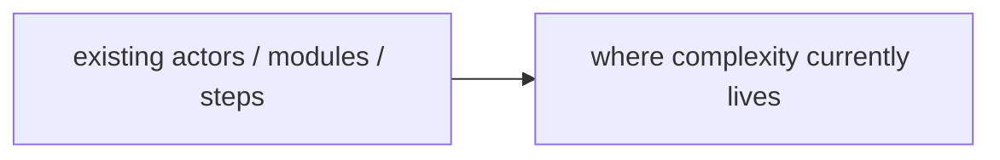
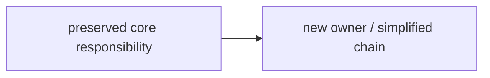

# Hai Razor Output Template

Use this template when auditing the existence necessity of requirements, workflow steps, fields,
states, modules, abstractions, or any chain. It is the canonical output shape referenced from
`SKILL.md` (Output section); the inline skeleton there is a summary of this. Keep verdicts
evidence-led. The verdict vocabulary — Keep / Merge / Defer / Delete / Replace / Prove first — must
match the decision table in `SKILL.md` verbatim. (For a Chinese-led run, see `SKILL.zh_CN.md`.)

```markdown
# Hai Razor: <scope>

## Verdict
- **Verdict**: <keep core / merge some / defer some / delete some / replace current shape / prove first>
- **One-line reason**: <the single most important existence-necessity judgment>
- **Razor principle used**: <the bar this audit applied for "deserves to exist">

## Audit Scope
- **Chain / targets**: <PRD, flow, module, field list, state machine, architecture boundary, etc.>
- **Current goal**: <what this chain claims to achieve>
- **Not audited**: <what this pass does not judge, to prevent mis-cutting>

## Evidence
| Source | What was seen | Supports / weakens which verdict | Confidence |
|--------|---------------|----------------------------------|------------|
| <PRD/code/schema/metrics/user flow/tests/logs/interviews/...> | <concrete evidence> | <the keep/delete/merge/defer/replace/prove-first verdict it bears on> | High/Med/Low |

> If evidence is missing, say so directly and downgrade the affected verdict to "Prove first" or "assumption."

## Before / After
<Required when the recommendation changes a substantial workflow, process, module chain, state
machine, service boundary, or architecture flow — a structural cut relocates responsibility, and the
reviewer must see the new owner. A small local audit may omit this with a stated reason.>

### Before


### After


## Razor Map
| Concept | Claimed purpose | What concretely breaks if deleted | Hidden owner | Verdict | Reason |
|---------|-----------------|-----------------------------------|--------------|---------|--------|
| <concept> | <what it claims to solve> | <user goal / invariant / safety / decision / ops impact> | <who absorbs the responsibility> | Keep/Merge/Defer/Delete/Replace/Prove first | <basis for the verdict> |

## To Cut or Merge
| Concept | Action | Strongest survival argument | Why it still falls short |
|---------|--------|-----------------------------|--------------------------|
| <concept> | Delete/Merge/Defer/Replace/Prove first | <strongest case for keeping it> | <why that case does not justify independent existence> |

## Complexity To Preserve
| Concept | Why preserved | Boundary that must not be mis-cut |
|---------|---------------|-----------------------------------|
| <concept> | <which goal, invariant, boundary, or risk it protects> | <where cutting starts to cause damage> |

## Shape After the Razor
<A short paragraph or list describing the smaller model after deletes, merges, or replacements.>

## Risks & Guardrails
- **Likely rebound**: <where future builders are most likely to reintroduce a deleted concept>
- **Mis-cut risk**: <real complexity that might have been deleted by mistake>
- **Guardrails**: <tests, acceptance criteria, naming, docs, architecture boundary, or follow-up proof tasks>

## Next Steps
<If executable, list the cut list; if evidence is thin, list the prove-first items; if it needs landing, route to the bam-mode plan reference.>

## HTML Artifact
- **Path**: `/tmp/hai-razor-<slug>/index.html`
- **When**: required for a full audit; a small local audit may skip it with a stated reason.
- **Contents**: verdict, evidence, before/after diagrams, Razor Map, cut/merge list, preserved complexity, risks, guardrails, next steps.
- **Visual**: restrained, clear, scannable — do not just paste the Markdown into HTML.
```
